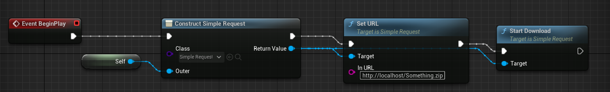

# SimpleRequest4UE

## introduction
This is a simple plugin for download file using HTTP, This plugin is build under UE5-early-access version(but it also work in UE4 I think?)

## install
1. download source code in github
2. place them in your project plugin folder
3. use as normal ue plugin

## Feature
- [x] download file
- [x] multi threat
- [x] frame download
- [ ] auto retry
- [ ] static download manager
- [ ] global config


## How To Use

### With Blueprint

#### Use Single Request

Use Blueprint to download single file is very simple just do it as follow



### With C++ Code

#### Use Single Request

```c++
USimpleRequest* SimpleRequest=NewObject<USimpleRequest>();
SimpleRequest->SetURL(InURL);
SimpleRequest->AddToRoot();
SimpleRequest->StartDownload();
```

